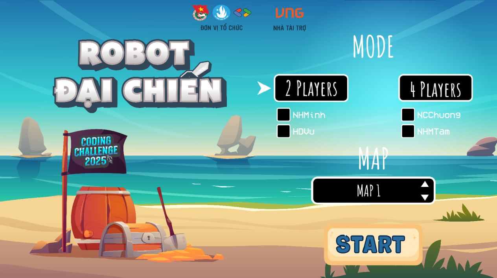
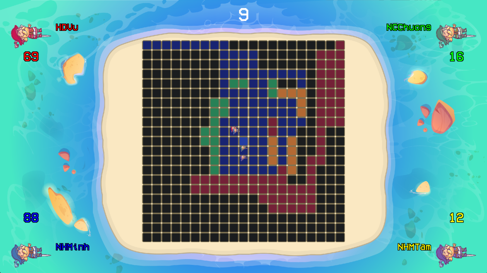
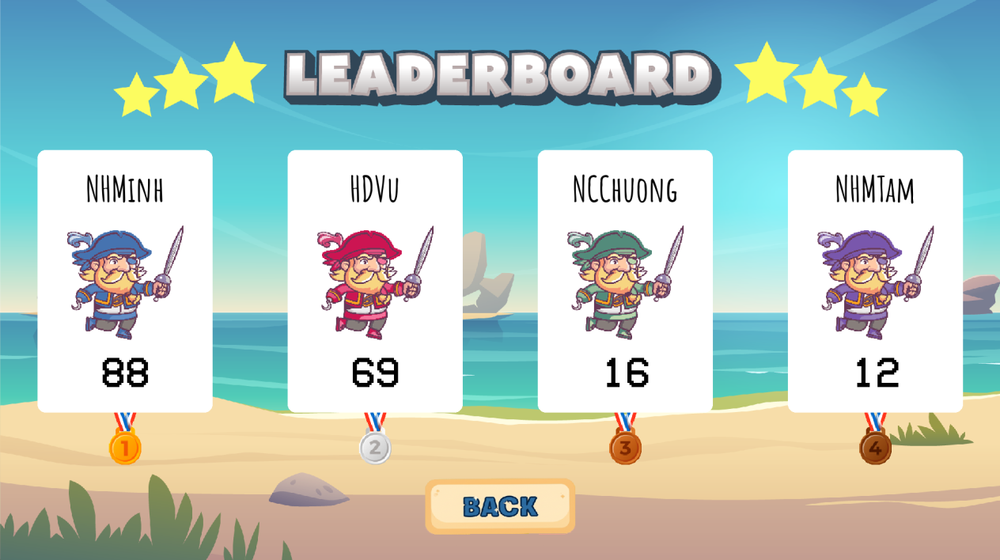

# Coding Challenge 2025 - Robot đại chiến
This is the repository of the frontend of the game "Robot đại chiến", used to visualize the matches between the bots.

Backend: [link](https://github.com/Coding-Challenge-2025/RobotDaiChien-FE.git)

## Requirements

The frontend is written in Python, with several packages used. To begin with, you need to have Python installed on your machine, specifically [Python 3.11](https://www.python.org/downloads/release/python-3110/) or higher.

You should also have a package manager to insall said dependencies for the interactor. The most commonly used one is [pip](https://pip.pypa.io/en/stable/); an alternative like [conda](https://docs.conda.io/en/latest/) can also be used (and recommended).

If you're a conda user, run this script beforehand.

```bash
conda create -n CodingChallenge2025 python=3.12
conda activate CodingChallenge2025
```

Now with a package manager available, install the necessary requirements.

```bash
pip install -r requirements.txt
```

## Usage

First, clone this repo

```bash
git clone https://github.com/Coding-Challenge-2025/RobotDaiChien-BE.git
```

To run the frontend

```bash
python main.py
```

* Game Menu Screen
<div align = "center">
  
</div>

* Game Screen
<div align = "center">
  
</div>

* Leaderboard Screen
<div align = "center">
  
</div>